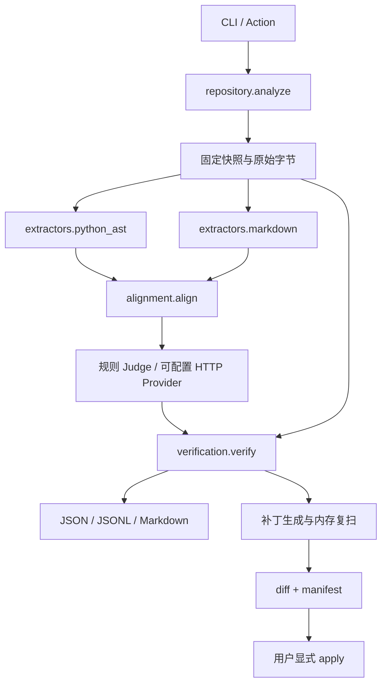

# 核心架构

DocSync 使用单进程流水线，CLI 和 Action 复用 `pipeline.scan`。仓库内容全程作为数据处理。

`SnapshotData` 持有只读用途的内存 blob；对外 `RepositorySnapshot` 仅记录相对路径、提交、文件哈希与工作树状态。`SourceSpan` 使用原文件字节区间 `[start_byte,end_byte)`，行从 1 开始。AST 列号按 UTF-8 字节使用，不做字符索引切片。所有支持文本当前要求 UTF-8。

`CodeEntity` 保留参数形态、必选性、装饰器；`CodeFact` 包括默认值、签名和简单配置。`LiteralValue` 携带递归类型，避免 `True == 1` 等 Python 比较语义造成误判。工厂、环境变量等表达式为 UNKNOWN；不求值。函数调用使用 `inspect.Signature.bind` 对哑值作参数绑定，不执行函数；类/实例接收者单独处理。唯一模块顶层的直接 `from ... import ...` 可生成别名事实，支持链式、相对导入和包导出；别名仍引用原始实体和源码 span。星号、条件或重绑定导出不解析。

Markdown 解析区分标题、正文、表格、围栏与 HTML。默认声明来自明确句式或 default 列；调用示例按签名绑定判断，不将显式传参当作默认声明。主体来自原句/最近标题/源码链接；围栏内简单 import 和实例别名辅助归属。历史、条件和动态解包语境拒绝确认。

候选只有唯一匹配时才进入确定性比较。Verifier 重新定位证据并建立同一 blob 的独立提取索引，每次 run 复用索引；两侧对象与规则结果一致后才发布 Finding。已忽略问题单列。只有已验证且未忽略的默认值/配置冲突才生成补丁；签名问题不自动编造参数，并在报告中提示人工处理。补丁绑定原始文件 SHA-256、canonical 行号/字节区间、确定性 patch/finding ID 和完整 diff，应用前再次核对全部 preimage；多文件失败时逆序回滚已写文件。

运行输出：`manifest.json`、`snapshot.json`、各阶段 JSONL、`summary.json` 和指定格式的报告。Schema 版本为 2.0，工具版本为 0.2.0；兼容读取旧 1.0 报告。`docsync schema` 导出契约。模型调用哈希/状态/usage、阶段耗时和状态事件写入 manifest。失败 run 保存结构化错误；已有非空 run 目录不覆盖。

COMPLETED 表示当前三类规则支持范围内完成。解析失败、资源超限、模型未配置或请求失败为 PARTIAL；未知事实/歧义为单声明 UNCERTAIN。模型判断不能绕过 Verifier，缺失密钥不会触发假响应。全局失败为 FAILED/退出 2；要求完整的部分扫描退出 3。
